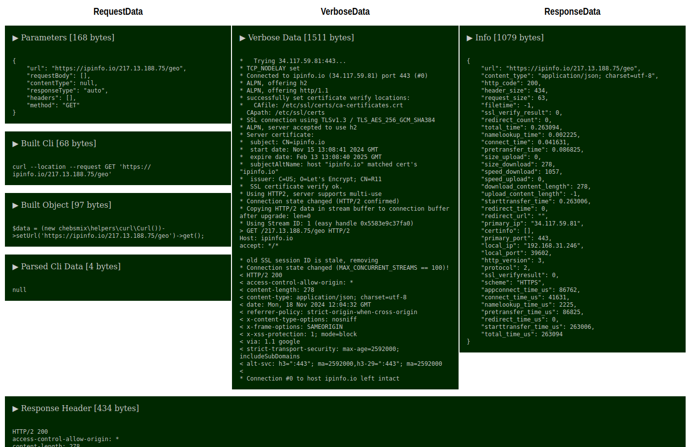

# CURL HELPER
## Methods description
- BASIC INIT METHODS
    - `setUrl(string $url)` - used to set URL to request (with query params)
    - `setRequestBody(array $body)` - sets an array of body data
    - `setRequestParams(array $params)` - possibility to set custom CURL_OPT settings
    - `setMethod(string $method)` - "GET" by default, set any of ["GET", "POST", "PATCH", "PUT", "DELETE"]
    - `setContentType(string $contentType)` - just 2 for now :) ["application/x-www-form-urlencoded", "application/json"], null by default
    - `setHeaders(array $headers)` - set any custom headers you want in 2 ways ["User-Agent" => "123", "X-Header: 123"]
    - `setResponseType(string $type)` - autodetect by default, can be manually set to "raw" or "json"
    - `init()` - used to initiate curl, it works automatically under the hood, but can be called manually
- DEBUG AND BUILD FEATURES
    - `buildCli()` - used to interpreter console curl command using current settings [returns a string]
    - `parseCli(string $cli)` - reverse feature, console curl command to helper`s initiation
    - `buildObject()` - can be used to construct a PHP code example of this helper using current settings [returns a string]
    - `info()` - just an output of the response info in array
    - `getVerboseData()` - VerboseData :)
    - `debug()` - use it to get full combined data of the request, verbose and response in a one array
    - `printDebug()` - same with printing it on webpage
- BASIC DATA ACQUISITION METHODS
    - `getResponse()` - main method to get data
    - `getHeaders()` - method to get only headers of the response
    - `code()` - returns http status code of the response
    - `isOkay()` - is it 200 ? :)
- ADDITIONAL DATA ACQUISITION METHODS
    - `get()` - sets GET method and calls `getResponse()`
    - `post()` - sets POST method and calls `getResponse()`
    - `patch()` - sets PATCH method and calls `getResponse()`
    - `put()` - sets PUT method and calls `getResponse()`
    - `delete()` - sets DELETE method and calls `getResponse()`
## Examples
- Set URL, headers, body and call `post` to get reponse using POST method
    ```
    $data = (new chebsmix\helpers\curl\Curl())
    ->setUrl('https://anysite.ru/api/v2/game/set-step')
    ->setHeaders(['Content-Type: application/x-www-form-urlencoded'])
    ->setRequestBody(['game_id' => '2', 'from' => '1:1', 'to' => '1:2', 'effectivity' => '2', 'mask' => '0101010010001010101001100110100101001010010101'])
    ->post();
    ```
- Get only headers of the request
    ```
    $curl = new Curl();
    $curl->setUrl('https://ipinfo.io/217.13.' . rand(0, 254) . '.' . rand(2, 254) . '/geo');
    echo $curl->getHeaders();
    ```
- Parse Curl CLI request and print debug page
    ```
    (new Curl())->parseCli("curl --location --request GET 'https://ipinfo.io/147.83." . rand(0, 254) . "." . rand(2, 254) . "/geo'")->printDebug();
    ```

    